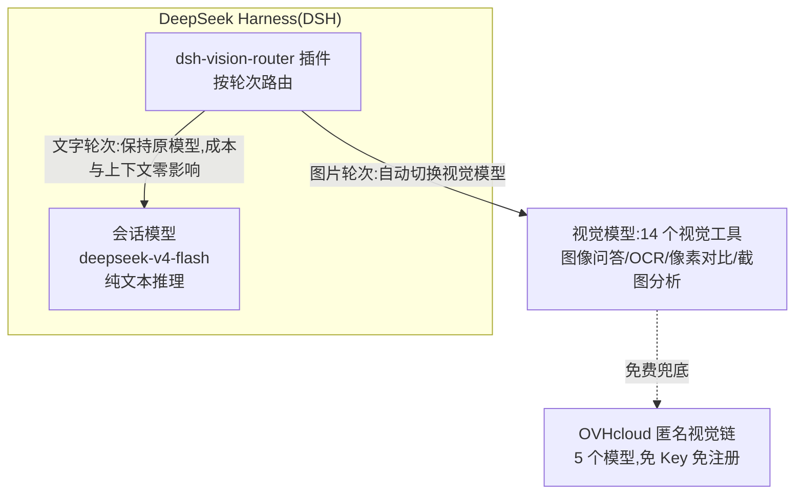

# DeepSeek Harness 视觉路由集成项目

> 为纯文本模型的 DeepSeek Harness(DSH)集成视觉能力:一次完整的插件评估、部署、验证与故障预案工程实践。

## 📌 项目简介

DeepSeek Harness(DSH)默认会话模型为纯文本推理模型(deepseek-v4-flash),**不具备图像输入能力**。本项目完成了一件关键的事:**在不更换会话模型的前提下,为 DSH 装上"眼睛"**——通过集成社区视觉路由插件 `dsh-vision-router`,使图片轮次自动路由到免费视觉模型,DeepSeek 继续负责推理,"看图"变成一次普通的工具调用。

这不是一个从零开发的插件,而是一次完整的 **第三方插件选型 → 部署 → 兼容性验证 → 故障预案** 工程实践,产出包括:可复现的部署步骤、逐项验证记录、以及一份面向"插件导致宿主崩溃"场景的应急处理手册。

## 🎯 项目背景与目标

| 问题 | 说明 |
|------|------|
| 模型能力限制 | DSH 会话模型为纯文本模型,无法接收图像输入 |
| 用户诉求 | 希望 DSH 具备看图能力(截图分析、图像问答、OCR 等),但不更换会话模型 |
| 风险控制 | 历史上社区插件曾导致 DSH 崩溃(加载器报错、配置损坏),必须建立故障预案后再动手 |

**目标**:以"先预案、后部署、再验证"的顺序,为 DSH 引入视觉能力,并沉淀一套可复用的插件管理方法论。

## 🏗️ 技术方案

### 架构总览



- 含图片的轮次(用户上传或工具结果如 `read_image`)由插件整体路由到视觉模型
- 文字轮次保持会话原模型:模型、成本、上下文完全不动
- "DeepSeek 负责思考,视觉模型负责看"

### 关键技术点

- **路由机制**:包含图片的轮次(用户上传或工具结果如 `read_image`)整体运行在视觉模型上;其余轮次保持会话原模型,文字轮次的模型、成本、上下文完全不动。
- **免费视觉链**:默认兜底为 5 个 OVHcloud 匿名视觉模型——免注册、免 Key,每 IP 每模型 2 次/分钟;用户自备视觉模型(OpenRouter / 硅基流动 / DashScope 等)优先调用。
- **工具集**:vision_describe(图像问答)、vision_ground(定位)、vision_crop(裁剪)、vision_pixel_diff(像素对比)、vision_colors(取色)、vision_ocr(文字识别)、vision_trace(SVG 矢量化)、vision_extract_foreground(抠图)、vision_html_screenshot(HTML 截图)等 14 个工具。
- **无 Python 依赖**:整条管线基于 sharp / potrace / tesseract / 系统 Chrome,无需 Python 环境。
- **Bundle 补丁机制**:插件通过 `dsh.bundle.patch` 自动挂载(声明式补丁,无需手工编辑 cordis 配置),与宿主 bundle(`dsh-base` / `dsh-web-app`)和已安装皮肤共存。

## 🔧 技术难点与解决方案

| 难点 | 解决方案 |
|------|---------|
| 纯文本模型无视觉能力,且不能换模型 | 引入按轮次路由的视觉插件:图片轮走视觉模型,文字轮保持原模型,实现"零替换"接入 |
| 历史上有插件导致宿主崩溃(加载器报错 `invalid plugin, received object`) | 根因分析:安装/运行期间文件被外部写入导致**文件竞态**;产出铁律——"运行期间不改源码、重启前杀进程、装完先重启再配置" |
| 配置损坏导致宿主无法启动(JSON 尾逗号、UTF-8 BOM) | 产出诊断与修复方案:先验证文件首字节与 JSON 合法性,再用插件自带 `doctor`/`repair` 工具自动修复,最后手动兜底 |
| 插件与既有皮肤/宿主的共存 | 通过 bundle 补丁机制(声明式补丁,不手工编辑 cordis 配置)实现多插件共存,验证通过 |

## 🚀 部署过程(可复现)

### 环境

| 项 | 值 |
|---|---|
| DSH 版本 | 0.1.0-rc.7 |
| Profile | `web`(`C:\Users\<你的用户名>\.dsh\profiles\web`) |
| Node.js | v24.16.0(系统)/ v24.19.0(桌面运行时) |
| 包管理器 | pnpm 11.22.0 |

### 安装步骤

```powershell
# 1. 备份当前 profile 配置(防患于未然)
Copy-Item package.json package.json.bak

# 2. 官方一条命令安装(自动完成:依赖 + bundle 注册 + lockfile 同步)
npx @deepseek-ai/dsh plugin --profile web add dsh-vision-router
```

安装完成后,`dependencies` 与 `dsh.profile.bundles` 均自动注册插件;既有的皮肤依赖不受影响。

### 验证记录

| 验证项 | 方法 | 结果 |
|--------|------|------|
| 依赖安装 | pnpm 安装日志 | ✅ 106 个包,17.5s |
| 配置写入 | 检查 `package.json` | ✅ 依赖与 bundles 均已注册 |
| 文件编码 | 首字节检查 | ✅ 无 BOM(JSON 可被 dsh 直接解析) |
| 皮肤共存 | 检查 bundles 列表 | ✅ maid-atelier 保留 |
| 模块加载 | Node 动态 import 预检 | ✅ `apply` 导出为 function,`Config` 正常 |
| 崩溃预防 | 加载预检 | ✅ 不会出现 `invalid plugin, received object` |

> 说明:上表为部署时人工逐项确认的 6 项记录;`scripts/verify.ps1` 在此基础上提供 8 项自动化预检(额外增加目录存在性与 JSON 语法检查),可随时重复执行。

## 📁 项目结构

```text
dsh-vision-integration/
├── README.md              # 项目介绍(本文件)
├── LICENSE                # MIT 协议(文档内容)
├── .gitignore             # 忽略备份/依赖/内部产物
├── scripts/               # 可执行脚本(verify.ps1 实测通过;install/recover 破坏性操作默认关闭)
│   ├── verify.ps1         # 一键预检:8 项检查链(JSON/BOM/bundles/模块加载)
│   ├── install.ps1        # 一键部署:备份 → 官方安装 → 自动预检
│   └── recover.ps1        # 崩溃恢复:杀进程 → doctor → repair → 验证
└── docs/
    ├── 处理手册.md         # 插件崩溃应急处理手册(症状速查/恢复流程/卸载/预防铁律)
    └── test-report-2026-08-18-1.md  # 预检脚本测试报告(8/8 通过,含复测记录)
```

### 快速上手

```powershell
# 部署前/部署后验证插件状态
.\scripts\verify.ps1

# 一键部署(备份→安装→自动预检)
.\scripts\install.ps1

# 插件崩溃时恢复(先诊断,再视情况 -Kill -Repair)
.\scripts\recover.ps1 -DoctorOnly
.\scripts\recover.ps1 -Kill -Repair
```

> 所有脚本均以 UTF-8 with BOM 编码保存,兼容 Windows PowerShell 5.1 中文环境。

## 🛡️ 故障预案(项目亮点)

本项目在部署前先完成了**崩溃处理手册**(见 `docs/处理手册.md`),覆盖:

- **7 类崩溃症状速查**:UTF-8 BOM 导致的 JSON 解析失败、重复 loader 注册、provider 冲突、文件竞态(`invalid plugin`)、尾逗号语法错误、pnpm 24 小时静默拦截、以及"图片不工作≠崩溃"的误判识别。
- **分级恢复流程**:杀进程 → 插件自带 `doctor`/`repair` 自动修复 → 手动兜底 → 重启验证。
- **6 条预防铁律**:运行期不改源码、重启前杀进程、官方命令安装、装完先重启再配置、改配置先备份、注意 24h 静默拦截。

**事故复盘方法论**:历史上社区插件导致 DSH 崩溃的两次事故(加载器报错、配置尾逗号),被完整转化为手册中的排查条目——这是本项目区别于"装上能用"的更深价值。

## 🧰 技术栈

DeepSeek Harness · Cordis(插件框架)· pnpm · Node.js · YAML(bundle 补丁)· PowerShell(自动化验证)· Markdown(文档)

## 📚 参考

- 上游插件:[ysr666/dsh-vision-router](https://github.com/ysr666/dsh-vision-router)(MIT License,仅作为部署目标引用,本项目不包含其源码)

## 📄 License

本项目文档内容 MIT License。
